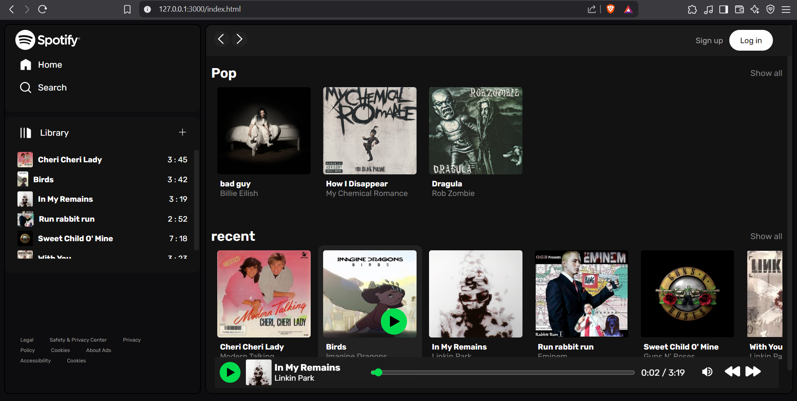
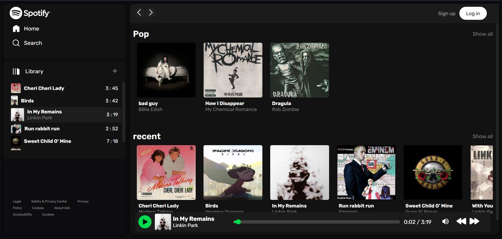
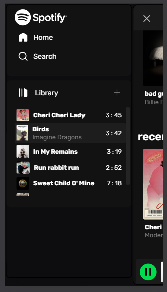
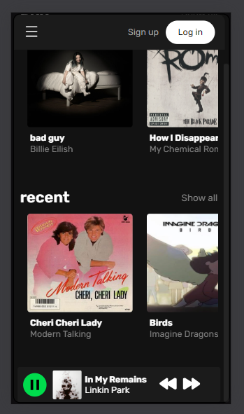

# Description

This is a standard clone project. Mainly deals with frontend/CSS skills.

### Desktop
<p float="left">
  
  
</p>

### Phone/Tab
<p float="left">
  
  
</p>

## Getting Started

To run the project:

```bash
git clone https://github.com/DivynshSingh/spotifyClone.git
